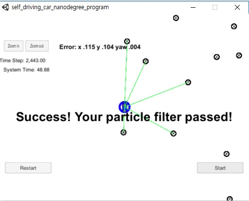

## Particle Filter Project

Overview:
---

Project Number #8 from the Udacity Sefl-Driving Car program (SDC). In this project a Particle filter is applied to localize the position of a car. A particle filter basically generates a cloud of particles in within a certain region and compares it with known landmarks within the region to determine the partcile's likelyhood to be close to the object being localized. The region and landmarks are in practical determined by a known map (such as google maps) and objects such as poles, traffic lights etc. The code initializes with a noisy (inaccurate) approximation of the current location using data from a GPS and proceeds to find the location using the particle filter.

Tools and techniques:
---

* Implemented in C++
* Simulator for results visualization

Reflections:
---

Particile filter is a very powerful and creative technique tu localize an autonomous vehicle when it is first turned-on and the car is not aware of its current position.

The idea and implementation of a particule filter is very dependant on existing map data, without any knowledge of the location current location the algorithm has no information to compare with the particles and therefore is of no value.

